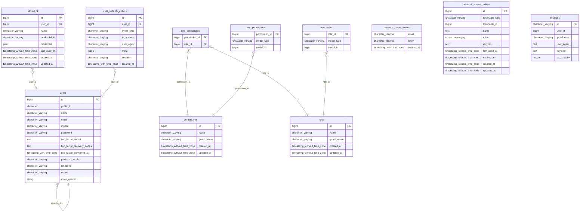
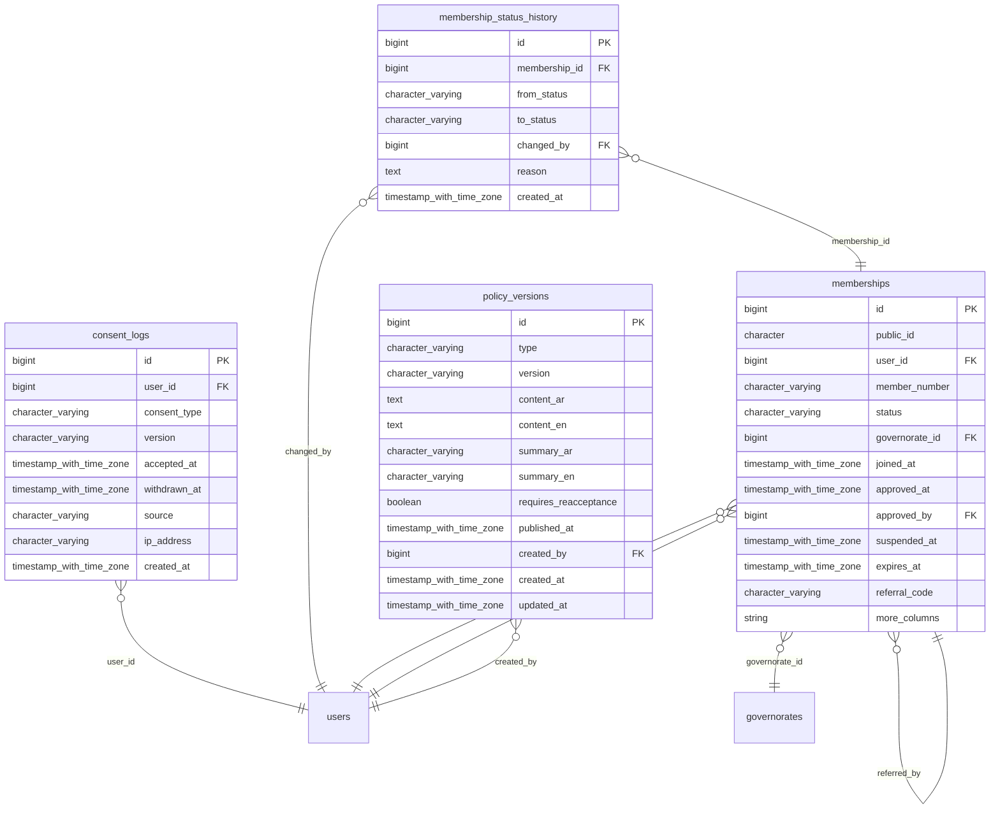
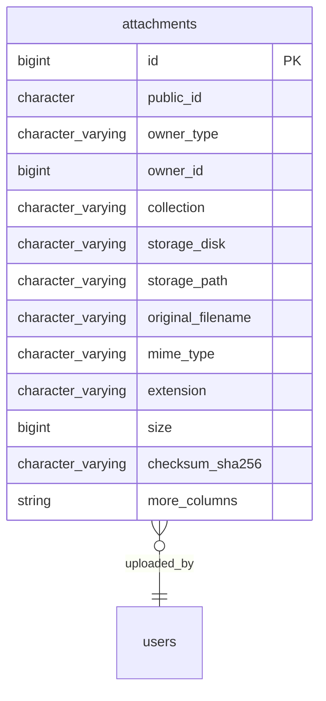

# Database documentation

_Generated by `php artisan ev:schema-docs` from the live PostgreSQL schema. Do not edit by hand._

- Tables: **38** · Foreign keys: **26** · Check constraints: **7**
- Conventions: bigint `id` primary keys; ULID `public_id` for externally visible entities; `decimal(14,2)` money + `currency` char(3); timestamps stored in UTC (`timestamptz`), displayed in Africa/Cairo; append-only ledgers (`member_ledger_entries`, `inventory_movements`, `audit_logs` — immutable trigger).
- Sensitive fields (encrypted or restricted): marked 🔒 in the dictionary.

## Domains

- **Authentication & users** (11): `passkeys`, `password_reset_tokens`, `permissions`, `personal_access_tokens`, `role_permissions`, `roles`, `sessions`, `user_permissions`, `user_roles`, `user_security_events`, `users`
- **Membership** (4): `consent_logs`, `membership_status_history`, `memberships`, `policy_versions`
- **Files, imports, exports** (1): `attachments`
- **System, audit, integrations, operations** (22): `areas`, `audit_logs`, `cache`, `cache_locks`, `countries`, `currencies`, `exchange_rates`, `failed_jobs`, `feature_flags`, `governorates`, `idempotency_keys`, `integration_events`, `integration_providers`, `integration_sync_logs`, `job_batches`, `jobs`, `migrations`, `module_settings`, `number_sequences`, `status_banners`, `system_settings`, `webhook_events`

## Entity-relationship diagrams

### Authentication & users

### Membership

### Files, imports, exports

### System, audit, integrations, operations

```mermaid
erDiagram
    areas }o--|| governorates : "governorate_id"
    audit_logs }o--|| users : "actor_id"
    exchange_rates }o--|| users : "entered_by"
    exchange_rates }o--|| currencies : "base_currency"
    exchange_rates }o--|| currencies : "quote_currency"
    governorates }o--|| countries : "country_code"
    idempotency_keys }o--|| users : "user_id"
    module_settings }o--|| users : "updated_by"
    status_banners }o--|| users : "created_by"
    system_settings }o--|| users : "updated_by"
    areas {
        bigint id PK
        bigint governorate_id FK
        character_varying name_ar
        character_varying name_en
        numeric latitude
        numeric longitude
        boolean is_active
        timestamp_with_time_zone created_at
        timestamp_with_time_zone updated_at
    }
    audit_logs {
        bigint id PK
        bigint actor_id FK
        character_varying actor_type
        character_varying action
        character_varying entity_type
        bigint entity_id
        character_varying entity_label
        jsonb old_values
        jsonb new_values
        text reason
        character_varying request_id
        character_varying ip_address
        string more_columns
    }
    cache {
        character_varying key
        text value
        bigint expiration
    }
    cache_locks {
        character_varying key
        character_varying owner
        bigint expiration
    }
    countries {
        character_varying code
        character_varying name_ar
        character_varying name_en
        character_varying dial_code
        boolean is_active
    }
    currencies {
        character_varying code
        character_varying name_ar
        character_varying name_en
        character_varying symbol
        smallint minor_units
        boolean is_base
        boolean is_active
        timestamp_with_time_zone created_at
        timestamp_with_time_zone updated_at
    }
    exchange_rates {
        bigint id PK
        character_varying base_currency FK
        character_varying quote_currency FK
        numeric rate
        character_varying source
        character_varying source_reference
        date rate_date
        text reason
        bigint entered_by FK
        timestamp_with_time_zone created_at
        timestamp_with_time_zone updated_at
    }
    failed_jobs {
        bigint id PK
        character_varying uuid
        character_varying connection
        character_varying queue
        text payload
        text exception
        timestamp_without_time_zone failed_at
    }
    feature_flags {
        character_varying key
        boolean enabled
        jsonb rules
        character_varying description
        timestamp_with_time_zone created_at
        timestamp_with_time_zone updated_at
    }
    governorates {
        bigint id PK
        character_varying country_code FK
        character_varying code
        character_varying name_ar
        character_varying name_en
        numeric latitude
        numeric longitude
        smallint sort_order
        boolean is_active
    }
    idempotency_keys {
        bigint id PK
        character_varying scope
        character_varying key
        bigint user_id FK
        character_varying request_hash
        character_varying status
        character_varying response_type
        character_varying response_reference
        jsonb response_payload
        timestamp_with_time_zone expires_at
        timestamp_with_time_zone created_at
        timestamp_with_time_zone updated_at
    }
    integration_events {
        bigint id PK
        character_varying provider
        character_varying direction
        character_varying operation
        character_varying reference
        character_varying status
        integer duration_ms
        text error
        jsonb meta
        timestamp_with_time_zone created_at
    }
    integration_providers {
        character_varying key
        character_varying driver
        character_varying status
        timestamp_with_time_zone last_checked_at
        timestamp_with_time_zone last_success_at
        text last_error
        jsonb public_config
        timestamp_with_time_zone created_at
        timestamp_with_time_zone updated_at
    }
    integration_sync_logs {
        bigint id PK
        character_varying provider
        character_varying job
        timestamp_with_time_zone started_at
        timestamp_with_time_zone finished_at
        character_varying status
        integer records_processed
        integer records_failed
        text summary
    }
    job_batches {
        character_varying id PK
        character_varying name
        integer total_jobs
        integer pending_jobs
        integer failed_jobs
        text failed_job_ids
        text options
        integer cancelled_at
        integer created_at
        integer finished_at
    }
    jobs {
        bigint id PK
        character_varying queue
        text payload
        smallint attempts
        integer reserved_at
        integer available_at
        integer created_at
    }
    migrations {
        integer id PK
        character_varying migration
        integer batch
    }
    module_settings {
        character_varying key
        boolean enabled
        jsonb settings
        bigint updated_by FK
        timestamp_with_time_zone created_at
        timestamp_with_time_zone updated_at
    }
    number_sequences {
        character_varying key
        integer year
        character_varying prefix
        bigint next_value
        smallint padding
        timestamp_with_time_zone created_at
        timestamp_with_time_zone updated_at
    }
    status_banners {
        bigint id PK
        character_varying level
        character_varying message_ar
        character_varying message_en
        jsonb targets
        boolean is_active
        timestamp_with_time_zone starts_at
        timestamp_with_time_zone ends_at
        bigint created_by FK
        timestamp_with_time_zone created_at
        timestamp_with_time_zone updated_at
    }
    system_settings {
        bigint id PK
        character_varying group
        character_varying key
        jsonb value
        character_varying type
        boolean is_public
        boolean is_sensitive
        bigint updated_by FK
        timestamp_with_time_zone created_at
        timestamp_with_time_zone updated_at
    }
    webhook_events {
        bigint id PK
        character_varying provider
        character_varying event_type
        character_varying external_event_id
        character_varying fingerprint
        jsonb headers
        jsonb payload
        boolean signature_valid
        character_varying status
        smallint retry_count
        text error
        timestamp_with_time_zone received_at
        string more_columns
    }
```

## Data dictionary

### Authentication & users

#### `passkeys`

| Column | Type | Nullable | Default | Notes |
|---|---|---|---|---|
| `id` | bigint | no | `nextval('passkeys_id_seq'::regclass)` | PK |
| `user_id` | bigint | no |  | FK → `users.id` (cascade) |
| `name` | character varying(255) | no |  |  |
| `credential_id` | character varying(255) | no |  | 🔒 |
| `credential` | json | no |  | 🔒 |
| `last_used_at` | timestamp without time zone | yes |  |  |
| `created_at` | timestamp without time zone | yes |  |  |
| `updated_at` | timestamp without time zone | yes |  |  |

Indexes: `UNIQUE (credential_id)`, `(user_id)`

#### `password_reset_tokens`

| Column | Type | Nullable | Default | Notes |
|---|---|---|---|---|
| `email` | character varying(255) | no |  | 🔒 |
| `token` | character varying(255) | no |  | 🔒 |
| `created_at` | timestamp with time zone | yes |  |  |

#### `permissions`

| Column | Type | Nullable | Default | Notes |
|---|---|---|---|---|
| `id` | bigint | no | `nextval('permissions_id_seq'::regclass)` | PK |
| `name` | character varying(255) | no |  |  |
| `guard_name` | character varying(255) | no |  |  |
| `created_at` | timestamp without time zone | yes |  |  |
| `updated_at` | timestamp without time zone | yes |  |  |

Indexes: `UNIQUE (name, guard_name)`

#### `personal_access_tokens`

| Column | Type | Nullable | Default | Notes |
|---|---|---|---|---|
| `id` | bigint | no | `nextval('personal_access_tokens_id_seq':` | PK |
| `tokenable_type` | character varying(255) | no |  | 🔒 |
| `tokenable_id` | bigint | no |  | 🔒 |
| `name` | text | no |  |  |
| `token` | character varying(64) | no |  | 🔒 |
| `abilities` | text | yes |  |  |
| `last_used_at` | timestamp without time zone | yes |  |  |
| `expires_at` | timestamp without time zone | yes |  |  |
| `created_at` | timestamp without time zone | yes |  |  |
| `updated_at` | timestamp without time zone | yes |  |  |

Indexes: `(expires_at)`, `UNIQUE (token)`, `(tokenable_type, tokenable_id)`

#### `role_permissions`

| Column | Type | Nullable | Default | Notes |
|---|---|---|---|---|
| `permission_id` | bigint | no |  | FK → `permissions.id` (cascade) |
| `role_id` | bigint | no |  | FK → `roles.id` (cascade) |

#### `roles`

| Column | Type | Nullable | Default | Notes |
|---|---|---|---|---|
| `id` | bigint | no | `nextval('roles_id_seq'::regclass)` | PK |
| `name` | character varying(255) | no |  |  |
| `guard_name` | character varying(255) | no |  |  |
| `created_at` | timestamp without time zone | yes |  |  |
| `updated_at` | timestamp without time zone | yes |  |  |

Indexes: `UNIQUE (name, guard_name)`

#### `sessions`

| Column | Type | Nullable | Default | Notes |
|---|---|---|---|---|
| `id` | character varying(255) | no |  | PK |
| `user_id` | bigint | yes |  |  |
| `ip_address` | character varying(45) | yes |  | 🔒 |
| `user_agent` | text | yes |  |  |
| `payload` | text | no |  |  |
| `last_activity` | integer | no |  |  |

Indexes: `(last_activity)`, `(user_id)`

#### `user_permissions`

| Column | Type | Nullable | Default | Notes |
|---|---|---|---|---|
| `permission_id` | bigint | no |  | FK → `permissions.id` (cascade) |
| `model_type` | character varying(255) | no |  |  |
| `model_id` | bigint | no |  |  |

Indexes: `(model_id, model_type)`

#### `user_roles`

| Column | Type | Nullable | Default | Notes |
|---|---|---|---|---|
| `role_id` | bigint | no |  | FK → `roles.id` (cascade) |
| `model_type` | character varying(255) | no |  |  |
| `model_id` | bigint | no |  |  |

Indexes: `(model_id, model_type)`

#### `user_security_events`

| Column | Type | Nullable | Default | Notes |
|---|---|---|---|---|
| `id` | bigint | no | `nextval('user_security_events_id_seq'::r` | PK |
| `user_id` | bigint | yes |  | FK → `users.id` (set null) |
| `event_type` | character varying(50) | no |  |  |
| `ip_address` | character varying(45) | yes |  | 🔒 |
| `user_agent` | character varying(255) | yes |  |  |
| `meta` | jsonb | yes |  |  |
| `severity` | character varying(10) | no | `'info'::character varying` |  |
| `created_at` | timestamp with time zone | no |  |  |

Indexes: `(event_type, created_at)`, `(user_id, created_at)`

#### `users`

| Column | Type | Nullable | Default | Notes |
|---|---|---|---|---|
| `id` | bigint | no | `nextval('users_id_seq'::regclass)` | PK |
| `public_id` | character(26) | no |  |  |
| `name` | character varying(255) | no |  |  |
| `email` | character varying(255) | no |  | 🔒 |
| `mobile` | character varying(20) | yes |  | 🔒 |
| `password` | character varying(255) | no |  | 🔒 |
| `two_factor_secret` | text | yes |  | 🔒 |
| `two_factor_recovery_codes` | text | yes |  | 🔒 |
| `two_factor_confirmed_at` | timestamp with time zone | yes |  |  |
| `preferred_locale` | character varying(5) | no | `'ar'::character varying` |  |
| `timezone` | character varying(64) | no | `'Africa/Cairo'::character varying` |  |
| `status` | character varying(20) | no | `'active'::character varying` |  |
| `email_verified_at` | timestamp with time zone | yes |  | 🔒 |
| `mobile_verified_at` | timestamp with time zone | yes |  | 🔒 |
| `last_login_at` | timestamp with time zone | yes |  |  |
| `last_login_ip` | character varying(45) | yes |  |  |
| `password_changed_at` | timestamp with time zone | yes |  | 🔒 |
| `disabled_at` | timestamp with time zone | yes |  |  |
| `disabled_by` | bigint | yes |  | FK → `users.id` (set null) |
| `remember_token` | character varying(100) | yes |  | 🔒 |
| `created_at` | timestamp with time zone | yes |  |  |
| `updated_at` | timestamp with time zone | yes |  |  |

Indexes: `(created_at)`, `UNIQUE (email)`, `UNIQUE (mobile)`, `UNIQUE (public_id)`, `(status)`

Checks: `CHECK (((preferred_locale)::text = ANY ((ARRAY['ar'::character varying, 'en'::character varying])::text[])))`, `CHECK (((status)::text = ANY ((ARRAY['active'::character varying, 'disabled'::character varying])::text[])))`

### Membership

#### `consent_logs`

| Column | Type | Nullable | Default | Notes |
|---|---|---|---|---|
| `id` | bigint | no | `nextval('consent_logs_id_seq'::regclass)` | PK |
| `user_id` | bigint | no |  | FK → `users.id` (restrict) |
| `consent_type` | character varying(30) | no |  |  |
| `version` | character varying(20) | yes |  |  |
| `accepted_at` | timestamp with time zone | yes |  |  |
| `withdrawn_at` | timestamp with time zone | yes |  |  |
| `source` | character varying(40) | no | `'web'::character varying` |  |
| `ip_address` | character varying(45) | yes |  | 🔒 |
| `created_at` | timestamp with time zone | no |  |  |

Indexes: `(user_id, consent_type, created_at)`

#### `membership_status_history`

| Column | Type | Nullable | Default | Notes |
|---|---|---|---|---|
| `id` | bigint | no | `nextval('membership_status_history_id_se` | PK |
| `membership_id` | bigint | no |  | FK → `memberships.id` (restrict) |
| `from_status` | character varying(20) | yes |  |  |
| `to_status` | character varying(20) | no |  |  |
| `changed_by` | bigint | yes |  | FK → `users.id` (set null) |
| `reason` | text | yes |  |  |
| `created_at` | timestamp with time zone | no |  |  |

Indexes: `(membership_id, created_at)`

#### `memberships`

| Column | Type | Nullable | Default | Notes |
|---|---|---|---|---|
| `id` | bigint | no | `nextval('memberships_id_seq'::regclass)` | PK |
| `public_id` | character(26) | no |  |  |
| `user_id` | bigint | no |  | FK → `users.id` (restrict) |
| `member_number` | character varying(20) | no |  |  |
| `status` | character varying(20) | no | `'pending'::character varying` |  |
| `governorate_id` | bigint | yes |  | FK → `governorates.id` (set null) |
| `joined_at` | timestamp with time zone | yes |  |  |
| `approved_at` | timestamp with time zone | yes |  |  |
| `approved_by` | bigint | yes |  | FK → `users.id` (set null) |
| `suspended_at` | timestamp with time zone | yes |  |  |
| `expires_at` | timestamp with time zone | yes |  |  |
| `referral_code` | character varying(16) | no |  |  |
| `referred_by` | bigint | yes |  | FK → `memberships.id` (set null) |
| `referral_source` | character varying(100) | yes |  |  |
| `verification_token` | character varying(64) | no |  | 🔒 |
| `verification_token_rotated_at` | timestamp with time zone | yes |  | 🔒 |
| `notes` | text | yes |  |  |
| `created_at` | timestamp with time zone | yes |  |  |
| `updated_at` | timestamp with time zone | yes |  |  |

Indexes: `UNIQUE (member_number)`, `UNIQUE (public_id)`, `UNIQUE (referral_code)`, `(status, created_at)`, `(status)`, `UNIQUE (user_id)`, `UNIQUE (verification_token)`

Checks: `CHECK (((status)::text = ANY ((ARRAY['pending'::character varying, 'active'::character varying, 'suspended'::character varying, 'rejected'::character varying, 'expired'::character varying])::text[])))`

#### `policy_versions`

| Column | Type | Nullable | Default | Notes |
|---|---|---|---|---|
| `id` | bigint | no | `nextval('policy_versions_id_seq'::regcla` | PK |
| `type` | character varying(30) | no |  |  |
| `version` | character varying(20) | no |  |  |
| `content_ar` | text | no |  |  |
| `content_en` | text | no |  |  |
| `summary_ar` | character varying(255) | yes |  |  |
| `summary_en` | character varying(255) | yes |  |  |
| `requires_reacceptance` | boolean | no | `false` |  |
| `published_at` | timestamp with time zone | yes |  |  |
| `created_by` | bigint | yes |  | FK → `users.id` (set null) |
| `created_at` | timestamp with time zone | yes |  |  |
| `updated_at` | timestamp with time zone | yes |  |  |

Indexes: `(type, published_at)`, `UNIQUE (type, version)`

### Files, imports, exports

#### `attachments`

| Column | Type | Nullable | Default | Notes |
|---|---|---|---|---|
| `id` | bigint | no | `nextval('attachments_id_seq'::regclass)` | PK |
| `public_id` | character(26) | no |  |  |
| `owner_type` | character varying(120) | yes |  |  |
| `owner_id` | bigint | yes |  |  |
| `collection` | character varying(60) | no | `'default'::character varying` |  |
| `storage_disk` | character varying(30) | no |  |  |
| `storage_path` | character varying(500) | no |  |  |
| `original_filename` | character varying(255) | no |  |  |
| `mime_type` | character varying(120) | no |  |  |
| `extension` | character varying(12) | no |  |  |
| `size` | bigint | no |  |  |
| `checksum_sha256` | character varying(64) | yes |  |  |
| `visibility` | character varying(10) | no | `'private'::character varying` |  |
| `variants` | jsonb | yes |  |  |
| `meta` | jsonb | yes |  |  |
| `uploaded_by` | bigint | yes |  | FK → `users.id` (set null) |
| `scanned_at` | timestamp with time zone | yes |  |  |
| `scan_status` | character varying(20) | no | `'not_scanned'::character varying` |  |
| `created_at` | timestamp with time zone | yes |  |  |
| `updated_at` | timestamp with time zone | yes |  |  |

Indexes: `(owner_type, owner_id, collection)`, `UNIQUE (public_id)`, `(uploaded_by)`

Checks: `CHECK ((size >= 0))`, `CHECK (((visibility)::text = ANY ((ARRAY['private'::character varying, 'public'::character varying])::text[])))`

### System, audit, integrations, operations

#### `areas`

| Column | Type | Nullable | Default | Notes |
|---|---|---|---|---|
| `id` | bigint | no | `nextval('areas_id_seq'::regclass)` | PK |
| `governorate_id` | bigint | no |  | FK → `governorates.id` (restrict) |
| `name_ar` | character varying(100) | no |  |  |
| `name_en` | character varying(100) | no |  |  |
| `latitude` | numeric(10,7) | yes |  |  |
| `longitude` | numeric(10,7) | yes |  |  |
| `is_active` | boolean | no | `true` |  |
| `created_at` | timestamp with time zone | yes |  |  |
| `updated_at` | timestamp with time zone | yes |  |  |

Indexes: `UNIQUE (governorate_id, name_en)`

#### `audit_logs`

| Column | Type | Nullable | Default | Notes |
|---|---|---|---|---|
| `id` | bigint | no | `nextval('audit_logs_id_seq'::regclass)` | PK |
| `actor_id` | bigint | yes |  | FK → `users.id` (set null) |
| `actor_type` | character varying(20) | no | `'user'::character varying` |  |
| `action` | character varying(80) | no |  |  |
| `entity_type` | character varying(120) | yes |  |  |
| `entity_id` | bigint | yes |  |  |
| `entity_label` | character varying(255) | yes |  |  |
| `old_values` | jsonb | yes |  |  |
| `new_values` | jsonb | yes |  |  |
| `reason` | text | yes |  |  |
| `request_id` | character varying(40) | yes |  |  |
| `ip_address` | character varying(45) | yes |  | 🔒 |
| `user_agent` | character varying(255) | yes |  |  |
| `created_at` | timestamp with time zone | no |  |  |

Indexes: `(action, created_at)`, `(actor_id, created_at)`, `(created_at)`, `(entity_type, entity_id)`, `(request_id)`

#### `cache`

| Column | Type | Nullable | Default | Notes |
|---|---|---|---|---|
| `key` | character varying(255) | no |  |  |
| `value` | text | no |  |  |
| `expiration` | bigint | no |  |  |

Indexes: `(expiration)`

#### `cache_locks`

| Column | Type | Nullable | Default | Notes |
|---|---|---|---|---|
| `key` | character varying(255) | no |  |  |
| `owner` | character varying(255) | no |  |  |
| `expiration` | bigint | no |  |  |

Indexes: `(expiration)`

#### `countries`

| Column | Type | Nullable | Default | Notes |
|---|---|---|---|---|
| `code` | character varying(2) | no |  |  |
| `name_ar` | character varying(80) | no |  |  |
| `name_en` | character varying(80) | no |  |  |
| `dial_code` | character varying(6) | yes |  |  |
| `is_active` | boolean | no | `true` |  |

#### `currencies`

| Column | Type | Nullable | Default | Notes |
|---|---|---|---|---|
| `code` | character varying(3) | no |  |  |
| `name_ar` | character varying(60) | no |  |  |
| `name_en` | character varying(60) | no |  |  |
| `symbol` | character varying(8) | yes |  |  |
| `minor_units` | smallint | no | `'2'::smallint` |  |
| `is_base` | boolean | no | `false` |  |
| `is_active` | boolean | no | `true` |  |
| `created_at` | timestamp with time zone | yes |  |  |
| `updated_at` | timestamp with time zone | yes |  |  |

#### `exchange_rates`

| Column | Type | Nullable | Default | Notes |
|---|---|---|---|---|
| `id` | bigint | no | `nextval('exchange_rates_id_seq'::regclas` | PK |
| `base_currency` | character varying(3) | no |  | FK → `currencies.code` (no action) |
| `quote_currency` | character varying(3) | no |  | FK → `currencies.code` (no action) |
| `rate` | numeric(18,8) | no |  |  |
| `source` | character varying(60) | no |  |  |
| `source_reference` | character varying(255) | yes |  |  |
| `rate_date` | date | no |  |  |
| `reason` | text | yes |  |  |
| `entered_by` | bigint | yes |  | FK → `users.id` (set null) |
| `created_at` | timestamp with time zone | yes |  |  |
| `updated_at` | timestamp with time zone | yes |  |  |

Indexes: `(base_currency, quote_currency, rate_date)`, `UNIQUE (base_currency, quote_currency, rate_date, source)`

Checks: `CHECK ((rate > (0)::numeric))`

#### `failed_jobs`

| Column | Type | Nullable | Default | Notes |
|---|---|---|---|---|
| `id` | bigint | no | `nextval('failed_jobs_id_seq'::regclass)` | PK |
| `uuid` | character varying(255) | no |  |  |
| `connection` | character varying(255) | no |  |  |
| `queue` | character varying(255) | no |  |  |
| `payload` | text | no |  |  |
| `exception` | text | no |  |  |
| `failed_at` | timestamp without time zone | no | `CURRENT_TIMESTAMP` |  |

Indexes: `(connection, queue, failed_at)`, `UNIQUE (uuid)`

#### `feature_flags`

| Column | Type | Nullable | Default | Notes |
|---|---|---|---|---|
| `key` | character varying(80) | no |  |  |
| `enabled` | boolean | no | `false` |  |
| `rules` | jsonb | yes |  |  |
| `description` | character varying(255) | yes |  |  |
| `created_at` | timestamp with time zone | yes |  |  |
| `updated_at` | timestamp with time zone | yes |  |  |

#### `governorates`

| Column | Type | Nullable | Default | Notes |
|---|---|---|---|---|
| `id` | bigint | no | `nextval('governorates_id_seq'::regclass)` | PK |
| `country_code` | character varying(2) | no | `'EG'::character varying` | FK → `countries.code` (no action) |
| `code` | character varying(10) | no |  |  |
| `name_ar` | character varying(80) | no |  |  |
| `name_en` | character varying(80) | no |  |  |
| `latitude` | numeric(10,7) | yes |  |  |
| `longitude` | numeric(10,7) | yes |  |  |
| `sort_order` | smallint | no | `'0'::smallint` |  |
| `is_active` | boolean | no | `true` |  |

Indexes: `UNIQUE (code)`

#### `idempotency_keys`

| Column | Type | Nullable | Default | Notes |
|---|---|---|---|---|
| `id` | bigint | no | `nextval('idempotency_keys_id_seq'::regcl` | PK |
| `scope` | character varying(80) | no |  |  |
| `key` | character varying(191) | no |  |  |
| `user_id` | bigint | yes |  | FK → `users.id` (set null) |
| `request_hash` | character varying(64) | yes |  |  |
| `status` | character varying(20) | no | `'processing'::character varying` |  |
| `response_type` | character varying(120) | yes |  |  |
| `response_reference` | character varying(191) | yes |  |  |
| `response_payload` | jsonb | yes |  |  |
| `expires_at` | timestamp with time zone | yes |  |  |
| `created_at` | timestamp with time zone | yes |  |  |
| `updated_at` | timestamp with time zone | yes |  |  |

Indexes: `(expires_at)`, `UNIQUE (scope, key)`

Checks: `CHECK (((status)::text = ANY ((ARRAY['processing'::character varying, 'completed'::character varying, 'failed'::character varying])::text[])))`

#### `integration_events`

| Column | Type | Nullable | Default | Notes |
|---|---|---|---|---|
| `id` | bigint | no | `nextval('integration_events_id_seq'::reg` | PK |
| `provider` | character varying(40) | no |  |  |
| `direction` | character varying(10) | no |  |  |
| `operation` | character varying(80) | no |  |  |
| `reference` | character varying(191) | yes |  |  |
| `status` | character varying(20) | no |  |  |
| `duration_ms` | integer | yes |  |  |
| `error` | text | yes |  |  |
| `meta` | jsonb | yes |  |  |
| `created_at` | timestamp with time zone | no |  |  |

Indexes: `(provider, created_at)`, `(reference)`

#### `integration_providers`

| Column | Type | Nullable | Default | Notes |
|---|---|---|---|---|
| `key` | character varying(40) | no |  |  |
| `driver` | character varying(60) | no | `'none'::character varying` |  |
| `status` | character varying(20) | no | `'not_configured'::character varying` |  |
| `last_checked_at` | timestamp with time zone | yes |  |  |
| `last_success_at` | timestamp with time zone | yes |  |  |
| `last_error` | text | yes |  |  |
| `public_config` | jsonb | yes |  |  |
| `created_at` | timestamp with time zone | yes |  |  |
| `updated_at` | timestamp with time zone | yes |  |  |

#### `integration_sync_logs`

| Column | Type | Nullable | Default | Notes |
|---|---|---|---|---|
| `id` | bigint | no | `nextval('integration_sync_logs_id_seq'::` | PK |
| `provider` | character varying(40) | no |  |  |
| `job` | character varying(80) | no |  |  |
| `started_at` | timestamp with time zone | no |  |  |
| `finished_at` | timestamp with time zone | yes |  |  |
| `status` | character varying(20) | no |  |  |
| `records_processed` | integer | no |  |  |
| `records_failed` | integer | no |  |  |
| `summary` | text | yes |  |  |

Indexes: `(provider, started_at)`

#### `job_batches`

| Column | Type | Nullable | Default | Notes |
|---|---|---|---|---|
| `id` | character varying(255) | no |  | PK |
| `name` | character varying(255) | no |  |  |
| `total_jobs` | integer | no |  |  |
| `pending_jobs` | integer | no |  |  |
| `failed_jobs` | integer | no |  |  |
| `failed_job_ids` | text | no |  |  |
| `options` | text | yes |  |  |
| `cancelled_at` | integer | yes |  |  |
| `created_at` | integer | no |  |  |
| `finished_at` | integer | yes |  |  |

#### `jobs`

| Column | Type | Nullable | Default | Notes |
|---|---|---|---|---|
| `id` | bigint | no | `nextval('jobs_id_seq'::regclass)` | PK |
| `queue` | character varying(255) | no |  |  |
| `payload` | text | no |  |  |
| `attempts` | smallint | no |  |  |
| `reserved_at` | integer | yes |  |  |
| `available_at` | integer | no |  |  |
| `created_at` | integer | no |  |  |

Indexes: `(queue)`

#### `migrations`

| Column | Type | Nullable | Default | Notes |
|---|---|---|---|---|
| `id` | integer | no | `nextval('migrations_id_seq'::regclass)` | PK |
| `migration` | character varying(255) | no |  |  |
| `batch` | integer | no |  |  |

#### `module_settings`

| Column | Type | Nullable | Default | Notes |
|---|---|---|---|---|
| `key` | character varying(50) | no |  |  |
| `enabled` | boolean | no | `true` |  |
| `settings` | jsonb | yes |  |  |
| `updated_by` | bigint | yes |  | FK → `users.id` (set null) |
| `created_at` | timestamp with time zone | yes |  |  |
| `updated_at` | timestamp with time zone | yes |  |  |

#### `number_sequences`

| Column | Type | Nullable | Default | Notes |
|---|---|---|---|---|
| `key` | character varying(40) | no |  |  |
| `year` | integer | no |  |  |
| `prefix` | character varying(12) | no |  |  |
| `next_value` | bigint | no | `'1'::bigint` |  |
| `padding` | smallint | no | `'6'::smallint` |  |
| `created_at` | timestamp with time zone | yes |  |  |
| `updated_at` | timestamp with time zone | yes |  |  |

#### `status_banners`

| Column | Type | Nullable | Default | Notes |
|---|---|---|---|---|
| `id` | bigint | no | `nextval('status_banners_id_seq'::regclas` | PK |
| `level` | character varying(20) | no |  |  |
| `message_ar` | character varying(255) | no |  |  |
| `message_en` | character varying(255) | no |  |  |
| `targets` | jsonb | no |  |  |
| `is_active` | boolean | no | `true` |  |
| `starts_at` | timestamp with time zone | yes |  |  |
| `ends_at` | timestamp with time zone | yes |  |  |
| `created_by` | bigint | yes |  | FK → `users.id` (set null) |
| `created_at` | timestamp with time zone | yes |  |  |
| `updated_at` | timestamp with time zone | yes |  |  |

Indexes: `(is_active, starts_at, ends_at)`

#### `system_settings`

| Column | Type | Nullable | Default | Notes |
|---|---|---|---|---|
| `id` | bigint | no | `nextval('system_settings_id_seq'::regcla` | PK |
| `group` | character varying(50) | no |  |  |
| `key` | character varying(120) | no |  |  |
| `value` | jsonb | yes |  |  |
| `type` | character varying(20) | no | `'string'::character varying` |  |
| `is_public` | boolean | no | `false` |  |
| `is_sensitive` | boolean | no | `false` |  |
| `updated_by` | bigint | yes |  | FK → `users.id` (set null) |
| `created_at` | timestamp with time zone | yes |  |  |
| `updated_at` | timestamp with time zone | yes |  |  |

Indexes: `("group")`, `UNIQUE (key)`

#### `webhook_events`

| Column | Type | Nullable | Default | Notes |
|---|---|---|---|---|
| `id` | bigint | no | `nextval('webhook_events_id_seq'::regclas` | PK |
| `provider` | character varying(40) | no |  |  |
| `event_type` | character varying(80) | yes |  |  |
| `external_event_id` | character varying(191) | yes |  |  |
| `fingerprint` | character varying(64) | no |  |  |
| `headers` | jsonb | yes |  |  |
| `payload` | jsonb | yes |  |  |
| `signature_valid` | boolean | yes |  |  |
| `status` | character varying(20) | no | `'received'::character varying` |  |
| `retry_count` | smallint | no | `'0'::smallint` |  |
| `error` | text | yes |  |  |
| `received_at` | timestamp with time zone | no |  |  |
| `processed_at` | timestamp with time zone | yes |  |  |

Indexes: `UNIQUE (provider, fingerprint)`, `(provider, status, received_at)`

